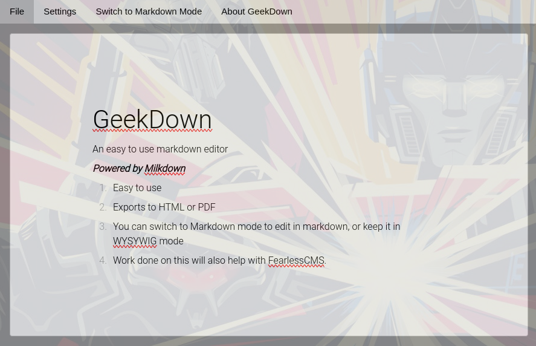

# GeekDown

<br />



GeekDown is an offline desktop markdown editor built with Milkdown/Crepe, W3.css, and Tauri.

<br />

## Features

- Real-time markdown preview
- Export to HTML with proper markdown rendering
- Export to PDF with visual formatting
- File open/save functionality
- Cross-platform (Linux, macOS, Windows)

<br />

This is being developed on Linux (Void/MX Linux) and tested on all platforms.

<br />

## Requirements

- Node.js (v18+)
- Rust (for Tauri build)
  - Install from https://rustup.rs
- On Linux: WebKit2GTK development libraries
  - Debian/Ubuntu: `sudo apt install webkit2gtk-driver libwebkit2gtk-4.0-dev libwebkit2gtk-4.1-dev`
  - Fedora: `sudo dnf install webkit2gtk3-devel webkit2gtk41-devel`
  - Arch: `sudo pacman -S webkit2gtk webkit2gtk-4.1`
  - **Void Linux**: `sudo xbps-install webkit2gtk-4.1-devel`
- For AppImage builds on non-Ubuntu systems:
  - Install `linuxdeploy` from https://github.com/linuxdeploy/linuxdeploy
  - Install `linuxdeploy-plugin-appimage` in the same directory as linuxdeploy
- Tauri CLI (optional, for global access):
  ```bash
  npm install -g @tauri-apps/cli
  ```

<br />

## Build & Install

**Quick build (recommended):**
```bash
# Linux/macOS
bash build.sh

# Windows (PowerShell)
.\build.ps1
```

**Manual build:**

**Install dependencies:**
```bash
npm install
```

**Development mode:**
```bash
# With WebKitGTK workarounds (Linux)
WEBKIT_DISABLE_DMABUF_RENDERER=1 WEBKIT_DISABLE_COMPOSITING_MODE=1 npm run tauri dev
```

**Production build:**
```bash
npm run build
npm run tauri build
```

The built binary will be approximately 4MB (vs Electron's 150-200MB).

**Note for Void Linux users**: If AppImage creation fails due to missing `linuxdeploy-plugin-webkit2gtk`, the AppDir will still be created. You can manually create the AppImage:
```bash
APPIMAGE_EXTRACT_AND_RUN=1 linuxdeploy --appdir src-tauri/target/release/bundle/appimage/GeekDown.AppDir --output appimage
```

<br />

**Installing the built application:**

After `npm run tauri build` completes, find the installer in:
- **Linux**: `src-tauri/target/release/bundle/` (AppImage or deb package)
- **Windows**: `src-tauri/target/release/bundle/` (NSIS installer or MSI)
- **macOS**: `src-tauri/target/release/bundle/` (DMG or PKG)

Run the installer for your platform to install GeekDown.

<br />

**Download pre-built binaries:**

Latest releases available at: https://github.com/fearlessgeekmedia/geekdown/releases

<br />

**Troubleshooting:**

If the application window appears blank on Linux, run with WebKitGTK workarounds:
```bash
WEBKIT_DISABLE_DMABUF_RENDERER=1 WEBKIT_DISABLE_COMPOSITING_MODE=1 npm run tauri dev
```

If you want to financially support this and other projects of mine, you may do so at <https://ko-fi.com/fearlessgeekmedia>