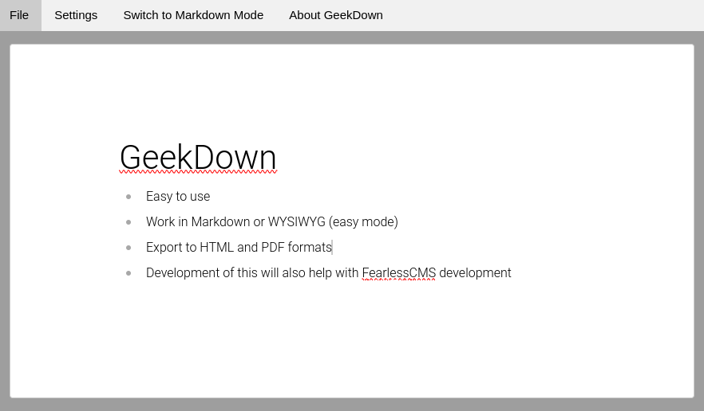

# GeekDown

<br />



GeekDown is a desktop markdown editor I created using Milkdown, Crepe, W3.css, and Electron.&#x20;

<br />

I wanted to get a little more experience with Milkdown before adding it to FearlessCMS.&#x20;

<br />

This is being tested on MX Linux, MacOS, and Windows 10. The Windows 10 version is tested in a virtual machine. This is alpha software at this time.

<br />

If you download the source, do the following.

<br />

**Build**

```
npm install @milkdown/crepe marked electron electron-builder vite --save-dev
```

To test

In one terminal window, run
```
npx vite
```

In a new terminal window/tab/pane, run

```
npm run electron:dev
```

To build

```
npm run electron:build
```

Your binary will be in the electron-dist directory. Enjoy!

<br />

If you want to financially support this and other projects of mine, you may do so at <https://ko-fi.com/fearlessgeekmedia>

<br />
